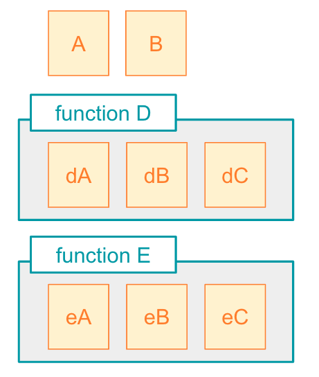

## 解説

### スコープ

JavaScriptで定義されるものは、変数、関数などそれぞれが「スコープ」を持っています。

その変数や関数などの「参照できる範囲」を決めるものがスコープになります。

スコープの中で定義されたもの（変数、関数）は、そのスコープ内からしか参照できません。

たとえば、javascriptを書いた際、下記のように定義されたもの（オレンジ＝変数、緑＝関数）があるとします。




#### 関数スコープ

上記の図の場合、functionD、functionEはそれぞれ１つの独立した **関数スコープ** として考えます。
つまり、functionDから、funcionEの中に定義された「eA」「eB」「eC」は、参照できません。
反対にfunctionEからも、functionDの中に定義されたものは参照できません。

functionD、Eの外側から、それぞれの内側に定義されたものを呼び出そうとする限り、JavaScriptでは「ReferenceError」が発生します。

しかし、funcionDからfunctionEそのものは呼び出すことが可能です。
functionDとfuncionE自体は同スコープ内に並列に定義されています。
「functionそのもの」であれば、同スコープ内で並列に定義された他のfunctionからは参照することができます。
（各functionの内側で独自に定義されたものについては、前述の通り呼び出すことはできません。）

#### グローバルスコープ

また、もっとも外側にあるスコープを **グローバルスコープ**といいます。

今回の図でいうと、一番上にある「A」「B」のボックスは何にも囲まれていない、グローバルスコープ内に定義された **グローバル変数** になります。

定義された変数、関数は、スコープの内側からは呼び出せます。
つまり、functionD、functionEの中からは、変数「A」「B」を呼び出すことが可能です。


#### ブロックスコープ

JavaScriptで書かれたコードの中で、``{``と``}``で囲んだ範囲を **ブロック** といいます。
たとえばif文やforループなどは、``{``と``}``を使用して範囲を確定する一つのブロックです。

ブロックも１つのスコープを作成します。

それぞれのブロックの中で宣言した変数は、そのブロックの外側からは参照できません。


## サンプルコード

### 関数スコープ、グローバルスコープ

```javascript
// グローバルスコープ
const A = 1;
const B = 2;

// 関数スコープ
function D() {
    let dA = "dA";
    let dB = "dB";
    let dC = A + B;
}

// 関数スコープ
function E() {
    let eA = "eA";
    let eB = "eB";
    let eC = A + B;
    functionD()
}
```

* A, B はグローバルスコープ内に、グローバル変数として定義されています。そのため、functionD、functionEからも参照可能
* functionD、functionEも同スコープ内（グローバルスコープ）に定義されているため、funcionEの中からfunctionDを参照可能
* ただし、funcionDとfunctionEは異なるスコープになるため、下記のようにfuncionEからfuncionDの内側に定義された「dA」「dB」「dC」を呼び出そうとするとReferenceErrorが発生（参照不可）

```javascript
// 関数スコープ
function E() {
    let eA = "eA";
    let eB = "eB";
    let eC = A + B;
    functionD()
    dA  // => ReferenceError: dA is not defined
}
```

### ブロックスコープ

```javascript
function func() {
    let a = 1;
    let b;

    if a < 5 {
        let c = 5;
        b = a + c;
    }

    for (let i = 0; i < 10, i ++) {
        let c = 10;
        b = c + i;
    }

    b = c + 1 // => ReferenceError: c is not defined
}
```

* 上記function func()内で定義されたif、forループはそれぞれブロックスコープを持つ
* それぞれのスコープが異なるため、同じ名前の変数cをそれぞれに定義可能
* 変数bは、if、forループのブロックスコープから参照可能
* 変数cは、if、forループの外からは呼び出そうとするとReferenceErrorが発生（参照不可）

## 問題

1.

funciton名：

input:

output: 


2.

funciton名：

input:

output: 

