# debuggerステートメント

## debuggerステートメントを使用したデバッグの方法

### 今回確認する内容

はじめに、こちらのzipファイルをダウンロードしてください。→[Zipファイル](./debugger.zip)

上記のページは、HTMLとJavaScriptで作成された、摂氏温度を華氏温度に変換するページです。

最終的に、下記のように温度が表示される予定ですが、現在何かしらの問題が起きていて、数字入力後に「Calculate!」のボタンをクリックしても、計算後の文字が出てきません。
今回はこちらのJavaScriptコードをデバッグし、問題を発見・修正しましょう。


HTML（BODY部のみ抜粋、詳細はWebページのソースを見てください）とJavaScriptのコードは下記のようになっています。

#### debugger.html

```html
    <body>
        <div class="calculater">
            <label for="name">摂氏温度を入力してください</label> <br />
            <input id="celcius" type="number" max="500" name="name"></input>
            <a id="calculateDegree">Calculate!</a>
        </div>

        <p id="degree"></p>
        <script type="text/javascript" src="debugger.js"></script>
    </body>
```

#### debugger.js

```javascript
function calculateF(celcius) {
    let fahrenheit=  celcius * 9 / 5 + 32;
    return fahrenheit
}

document.getElementById("calculateDegree").onclick = () => {
    let celciusNumber = document.getElementById("celcius").value;
    let fahrenheitNumber = calculateF(celciusNumber)
    document.getElementById("digree").innerHTML = "摂氏 " + celciusNumber + "度は、華氏" + fahrenheitNamber.toFixed(2) + "度です。";
}
```

### デバッグのフロー

1. JavaScriptのコードに``debugger``ステートメントを挿入
2. ブラウザの検証ツール／デバッガーツールを開く
3. コードを実行し、ステップ実行を行いながら、ブレークポイントごとに変数の値などを確認
4. 問題のある箇所を特定し、修正

### ブレークポイントとは？

ブレークポイントとは、**実行中のプログラムを意図的に一時停止する箇所**のことです。

開発者の任意の箇所（コード行）に設定できるため、どの時点で一時停止するかを決めることができます。


今回はデバッガーツールを使用し、JavaScriptコード上に手動でマークをつけながら、プログラムを一時停止できるようにします。　

### デバッガーツールの見方

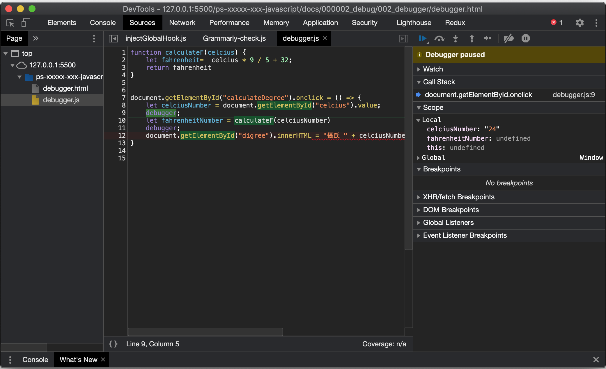

今回はGoogle Chromeブラウザのデバッガーツールを使用し、デバッグを進めます。

後ほどデバッガーツールの開き方など一つずつ進めていきますが、はじめに画面の見方を確認しましょう。

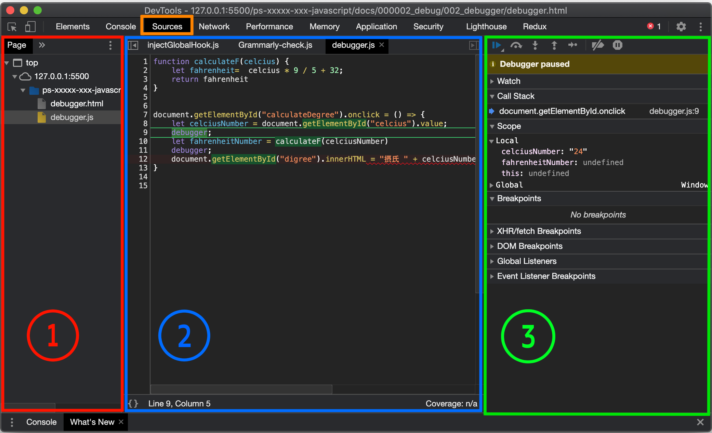

#### ①左側：ソースファイル

左側は、現在開いているWebページを読み込んだ際にimportされたソースファイルの一覧がツリーとして表示されます。

今回のファイルはHTMLファイルとJavaScriptファイルで構成されているため、その2種類のファイル名が並んでいます。
　
#### ②真ん中：コード

左側のソースファイルにて選択したファイルのコードが表示されます。

#### ③右側：デバッガーの操作パネル&今のプログラムの状況

実際にデバッグを行う中で、プログラムのステップ実行の操作や、現在の変数の状態を確認することができます。

##### コールスタックパネル（callstack ）

実行中のプログラムについて、どういう関数を経由して現在の行が呼ばれているか、関数の順序（コールスタック）が記録されます。

##### スコープパネル（Scope）

現在のプログラムの中で使える変数などのデータが見えます。

読み込んでいる現在の行時点での変数の状態を、ローカル／グローバルともに確認することができます。

##### ブレークポイントパネル（breakpoints）

設定しているブレークポイントのオンオフを切り替えすることができます。


## プログラムのステップ実行とは

ブレークポイントを設定したプログラムを実行すると、ブレークポイントの箇所でプログラムは一時停止します。
その後、以下のステップ実行のいずれかを選択し、次のプログラムの実行を「どこまで」行うかを選びながら、コードを確認・読み進めていきます。

### リジューム

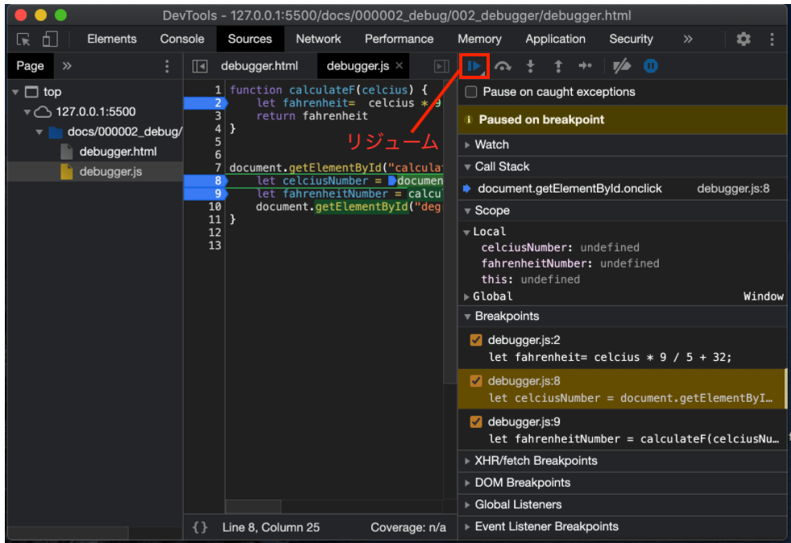


今回のフローでも行う、ブレークポイントで止まった処理を再開する動作です。
再開後については、次のブレークポイントまでか、（ブレークポイントが設定されていない場合は）処理を最後まで実行します。

### ステップイン

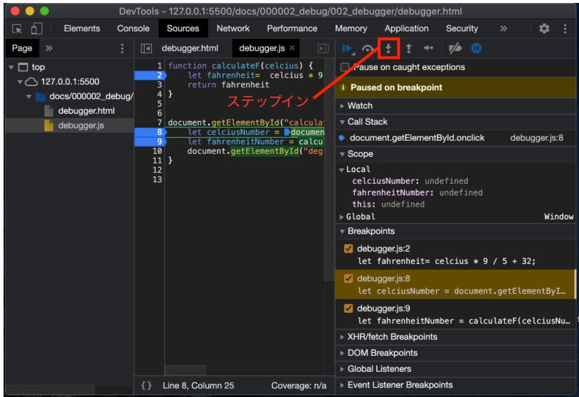


ブレークポイントで処理が止まった際、その設定したブレークポイントの行のプログラムはまだ実行されません。

しかし、ステップインを実行すると、ブレークポイントを設定している行の処理後に再度一時停止し、状態を確認できます。

処理の流れを一つ一つ確認したい場合に使用します。

### ステップアウト

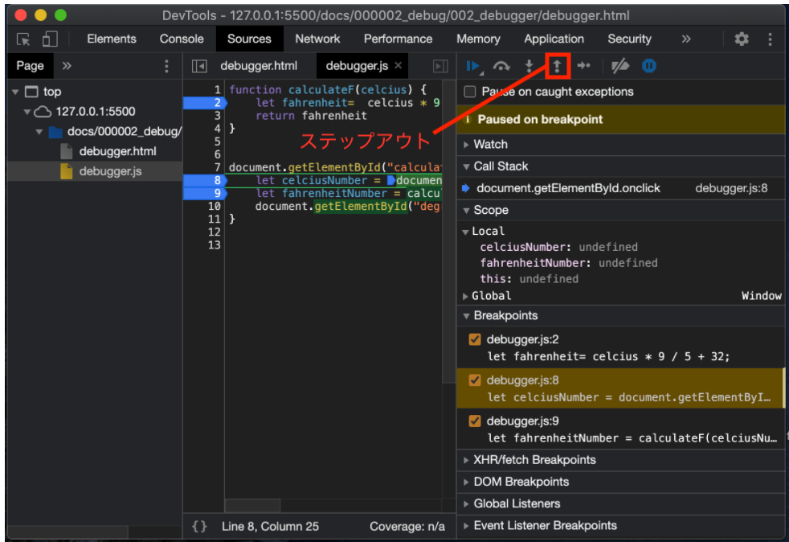


ステップアウトは、現在実行している関数内の残りの処理をすべて実行し、その時点で一時停止を行います。


### ステップオーバー

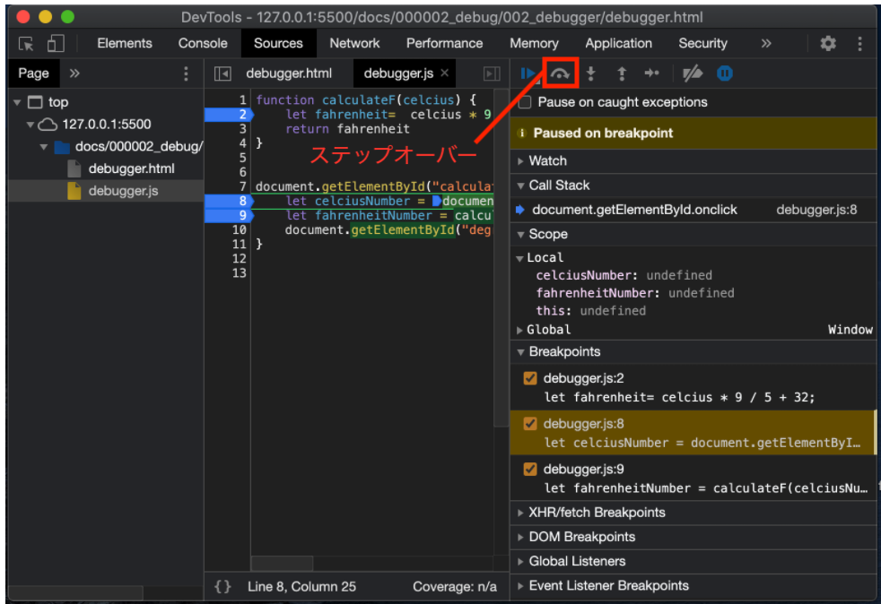

ステップオーバーは、現在実行している関数内のうち、他の関数を呼び出している行までの残りの処理を実行します。その後、呼び出されている関数に処理が移った時点で一時停止を行います。


## 検証（デベロッパー）ツールの開き方

#### webページで右クリック→「検証」を選択


#### 出てきた「DevTools」の画面の上部選択を「Elements」から「Sources」に変更


#### ページ左部の選択を「debugger.html」から「debugger.js」に変更


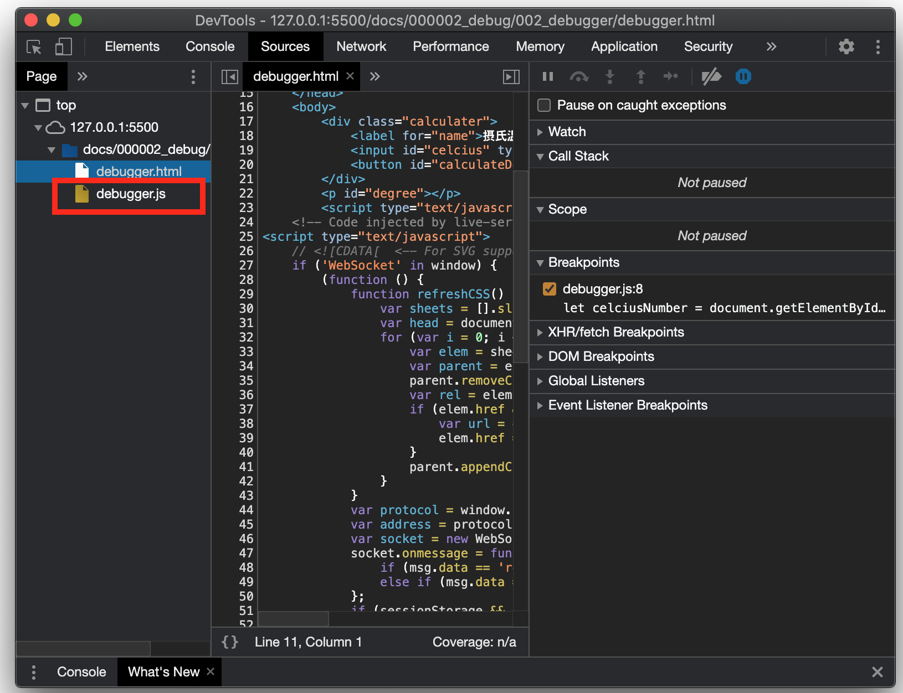

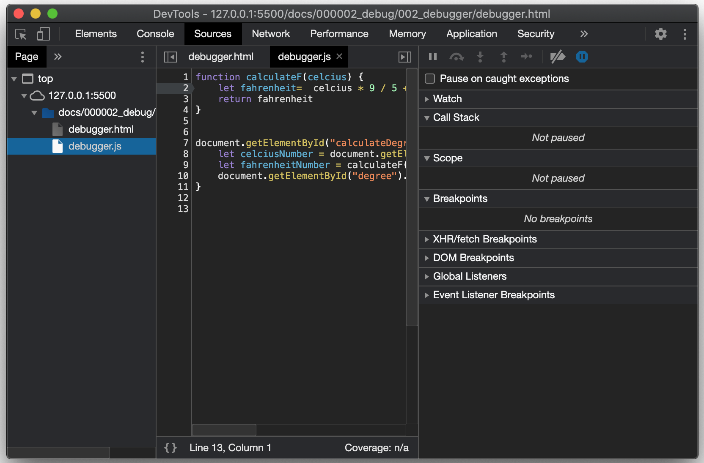


ここでは、このページを構成するファイル群と、その中身を確認できます。

## デバッグ

ここから、実際にデバッグを行っていきます。
まずはJavaScript内で設定されている変数を見ていきます。

### ブレークポイントの設定

ブレークポイントを設定したい箇所に
``debugger``ステートメントを差し込みます。

``debugger``ステートメントは、その関数が呼ばれた時に、デバッガーが起動していれば処理が一時停止します。

ステートメントの差し込みは、JavaScriptファイルに直接行いますので、JavaScriptファイルをエディタで開き、編集してください。

```javascript
function calculateF(celcius) {
    let fahrenheit=  celcius * 9 / 5 + 32;
    return fahrenheit
}


document.getElementById("calculateDegree").onclick = () => {
    let celciusNumber = document.getElementById("celcius").value;
    debugger;  // ここにdebuggerを挿入
    let fahrenheitNumber = calculateF(celciusNumber)
    debugger;  // ここにdebuggerを挿入
    document.getElementById("digree").innerHTML = "摂氏 " + celciusNumber + "度は、華氏" + fahrenheitNumber.toFixed(2) + "度です。";
}
```

### コードの実行と変数の確認

では、実際にJavaScriptコードを実行してみます。
検証ツール画面を開いたまま、元のWebページに数字を入力、「Calculate!」ボタンを押してみましょう。

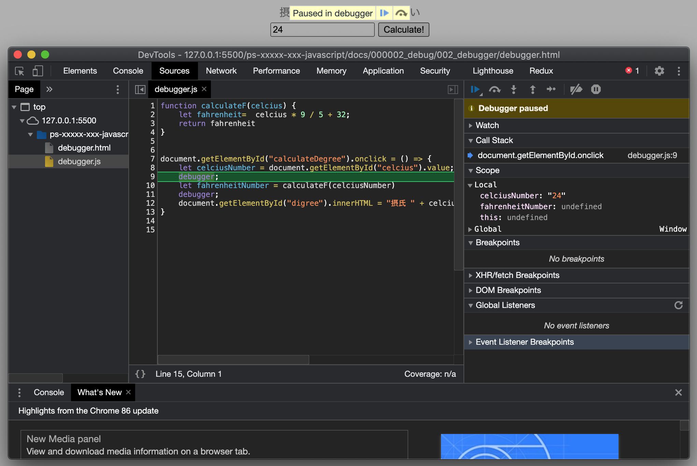

最初に``debugger``を挿入した9行目で、コードの処理がストップしました。

この時点での、JavaScript内で設定した変数の値を確認したい時には、画面右側の「Scope」欄を見てみましょう。
現時点では、8行目の処理が終わった段階なので、変数``celciusNumber``に``"24"``が代入されています。
また、それ以外の変数は、まだ処理が行われていないためすべて「undefined」になっています。

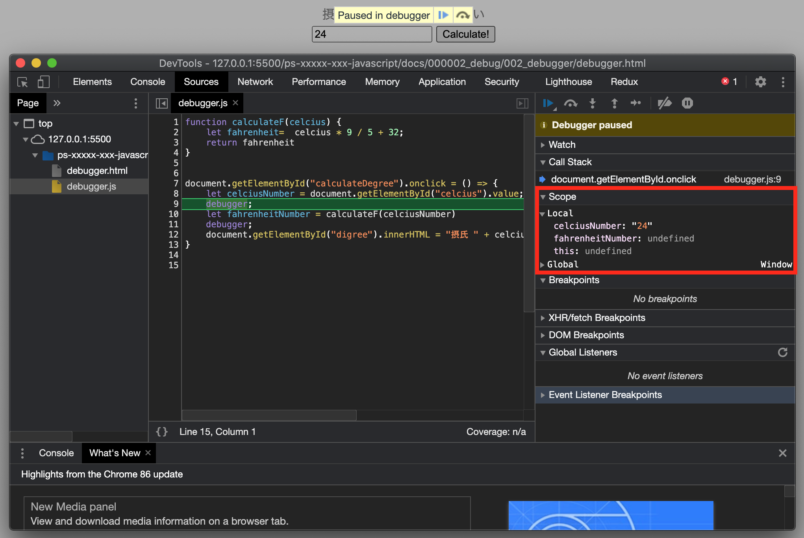

### 処理の再開（次のブレークポイントまで移動）

上記の時点では何も確認できなかったので、コードの処理を進めます。
その際は右側、「Scope」欄などがあった部分の上の横三角ボタンを押してみましょう。次のブレークポイントまで進みます。
（カーソルを上に合わせると「Resume script execution」と出ます）

すると、次の行に進みました。


ここでもう一度右の「Scope」欄で、変数を確認すると、変数``fahrenheitNumber``の値が「undefined」から「75.2」に変わっています。
これは、10行目の処理が終わり、HTMLの入力内容をJavaScriptが読み取った結果、変数に値が代入されたためです。

### 変数の確認②

この時、すでに値の代入された変数については、真ん中のコードが書かれた画面でも確認ができます。

確認したい変数にカーソルを持っていくと、現在代入されている値が表示されます。

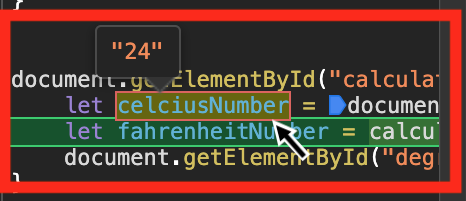


### エラーの特定

現時点での変数を確認しましたが、``celciusNumber`` ``fahrenheitNumber``、どちらの変数にも問題なく数字が入っています。

つまり、最後の11行目以降、すなわち12行目に問題があると考えられます。


### エラーの修正

ここまでの作業では、変数に問題はなく、最後までエラーは出ませんでした。
そこで、12行目を見るとHTMLから取得すべきid名が、本来「degree」であるべきところ「digree」になっています。

これがエラーの原因になるため、ここのid名称を正しいものに変更すれば、デバッグの完了です。
