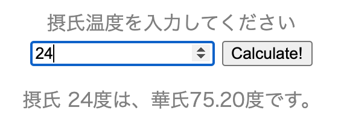
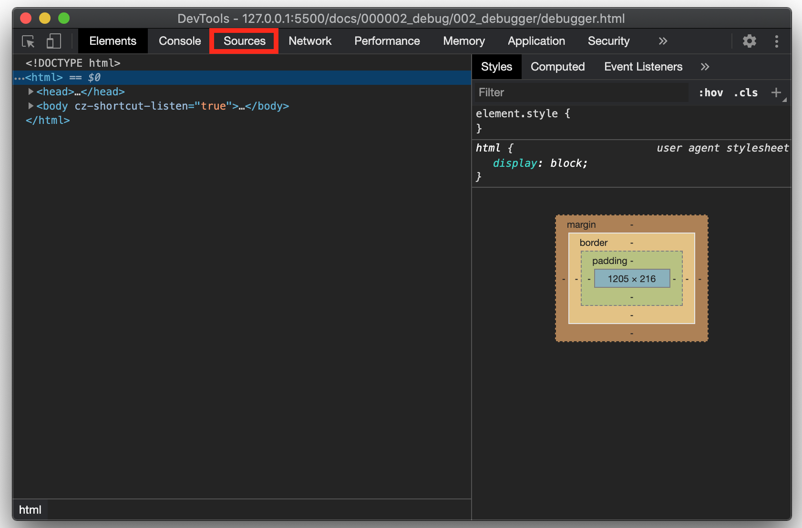
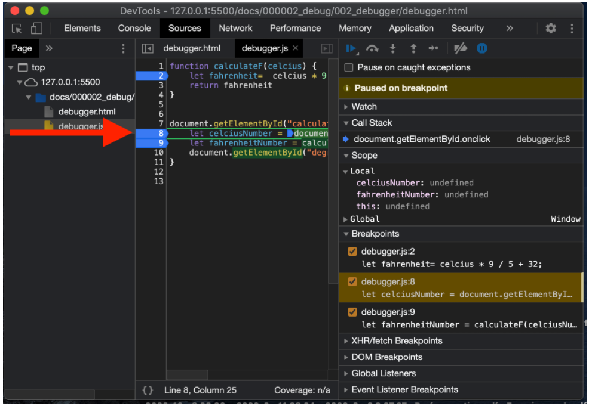
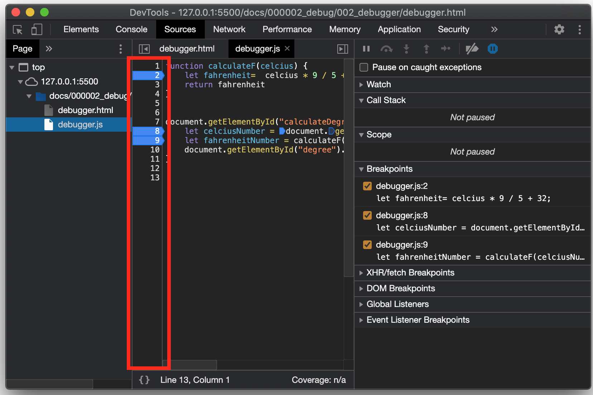
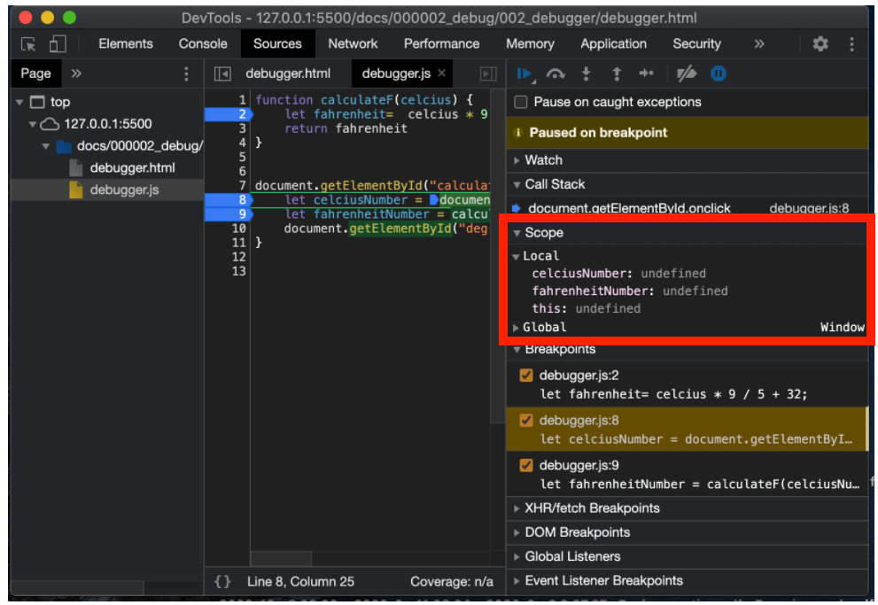
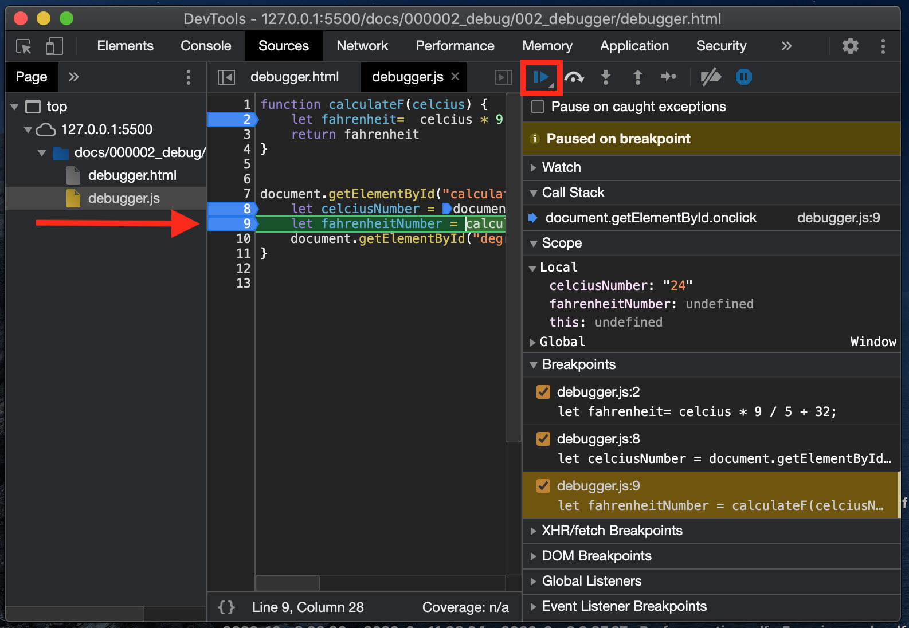
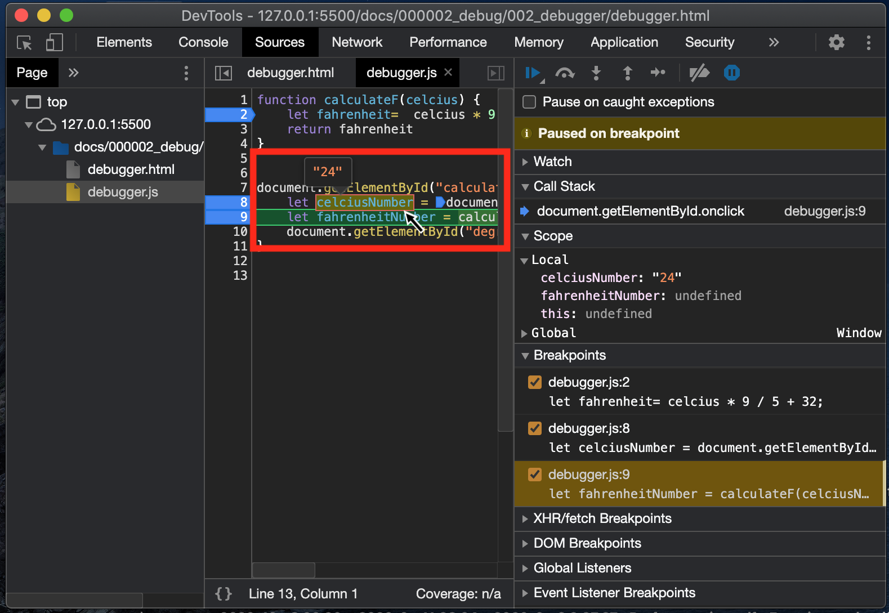
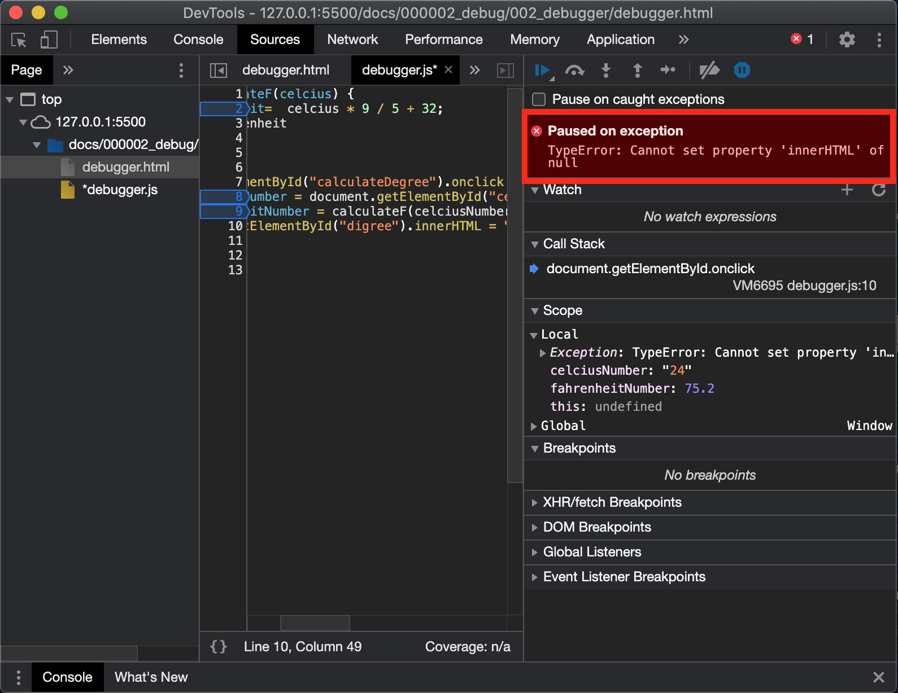

# debugger

## Google Chromeの検証（デベロッパー）ツールを使ってデバッグする方法

### 今回確認する内容

ブラウザの検証ツールを使用し、そこでJavaScriptのデバッグを行います。

[こちらのページを開いてください](./debugger.html)

上記のページは、HTMLとJavaScriptで作成された、摂氏温度を華氏温度に変換するページです。

最終的に、下記のように温度が表示される予定ですが、現在何かしらの問題が起きていて、数字入力後に「Calculate!」のボタンをクリックしても文字が出てきません。
今回はこちらのJavaScriptコードをデバッグし、問題を発見・修正しましょう。


HTML（BODY部のみ抜粋、詳細はWebページのソースを見てください）とJavaScriptのコードは下記のようになっています。

#### debugger.html



```html
    <body>
        <div class="calculater">
            <label for="name">摂氏温度を入力してください</label> <br />
            <input id="celcius" type="number" max="500" name="name"></input>
            <a id="calculateDegree">Calculate!</a>
        </div>

        <p id="degree"></p>
        <script type="text/javascript" src="debugger.js"></script>
    </body>
```

#### debugger.js

```javascript
function calculateF(celcius) {
    let fahrenheit=  celcius * 9 / 5 + 32;
    return fahrenheit
}

document.getElementById("calculateDegree").onclick = () => {
    let celciusNumber = document.getElementById("celcius").value;
    let fahrenheitNumber = calculateF(celciusNumber)
    document.getElementById("degree").innerHTML = "摂氏 " + celciusNumber + "度は、華氏" + fahrenheitNamber.toFixed(2) + "度です。";
}
```

### 検証（デベロッパー）ツールの開き方

#### webページで右クリック→「検証」を選択


#### 出てきた「DevTools」の画面の上部選択を「Elements」から「Sources」に変更



#### ページ左部の選択を「debugger.html」から「debugger.js」に変更





ここでは、このページを構成するファイル群と、その中身を確認できます。

### 変数の中身の確認

ここから、実際にデバッグを行っていきます。
まずはJavaScript内で設定されている変数を見ていきます。

#### ブレイクポイントの設定

デバッグを行う上で、まず元にブレイクポイントを設定します。
これはコードが読み込まれている過程の中、「**この時点でのJavaScriptの状態を、一時停止して確認したい箇所**」にマークをつけて、一時停止できるようにします。


ブレイクポイントを設定したい箇所は、画面真ん中の、JavaScriptコードの行数が書かれている箇所をクリックすることで選択できます。

ブレイクポイントの設定はいくつでも可能です。　今回は2, 8, 9行目を選択しました。



#### コードの実行と変数の確認

では、実際にJavaScriptコードを実行してみます。
検証ツール画面を開いたまま、元のWebページに数字を入力、「Calculate!」ボタンを押してみましょう。



最初のブレイクポイントを設定した8行目で、コードの処理がストップしました。
設定したポイントの、コードが実行される直前の状態で止まります。

この時点での、JavaScript内で設定した変数の値を確認したい時には、画面右側の「Scope」欄を見てみましょう。
現時点では、まだ8行目が実行されておらず、Webページ上のフォームに入力された数字を読み取っていないため、すべて「undefined」になっています。

### 処理の再開（次のブレイクポイントまで移動）

上記の時点では何も確認できなかったので、コードの処理を進めます。
その際は右側、「Scope」欄などがあった部分の上の横三角ボタンを押してみましょう。次のブレイクポイントまで進みます。
（カーソルを上に合わせると「Resume script execution」と出ます）

すると、次の行に進みました。



ここでもう一度右の「Scope」欄で、変数を確認すると、変数``celciusNumber``の値が「undefined」から「24」に変わっています。
これは、８行目の処理が終わり、HTMLの入力内容をJavaScriptが読み取った結果、変数に値が代入されたためです。

#### 変数の確認②

この時、すでに値の代入された変数については、真ん中のコードが書かれた画面でも確認ができます。

確認したい変数にカーソルを持っていくと、現在代入されている値が表示されます。




#### エラーの発生

JavaScriptの処理を進めていくと、最後にエラーが発生しました。



この時点での変数を確認すると、``celciusNumber`` ``fahrenheitNumber``、どちらの変数にも問題なく数字が入っています。

また、エラー文を見ると「Cannot set property 'innerHTML' of null」と出ています。
どうやらHTMLからの情報の取得がうまくいっておらず、innerHTMLとして設定したい値をsetできないようです。

#### エラーの修正

ここまでの作業では、変数に問題はなく、最後以外にエラーは出ませんでした。
そこで、エラーの発生した10行目をよく見ると、HTMLから取得すべきid名が、本来「degree」であるべきところ「digree」になっています。

これがエラーの原因になるため、ここのid名称を正しいものに変更すれば、デバッグの完了です。

## プログラムのステップ実行

### リジューム

上記のフローでも行った、ブレイクポイントで止まった処理を再開する動作です。
再開後については、ブレイクポイントが設定されていない限り、処理を最後まで実行します。

### ステップイン

ブレイクポイントで処理が止まった際、その設定したブレイクポイントの行のプログラムはまだ実行されません。（上のフローで行った通りです）

しかし、ステップインを実行すると、ブレイクポイントを設定している行の処理後に再度一時停止し、状態を確認できます。

処理の流れを一つ一つ確認したい場合に使用します。

### ステップアウト

ステップアウトは、現在実行している関数内の残りの処理をすべて実行し、その時点で一時停止を行います。


### ステップオーバー

ステップオーバーは、現在実行している関数内のうち、他の関数を呼び出している行までの残りの処理を実行します。その後、呼び出されている関数に処理が移った時点で一時停止を行います。

